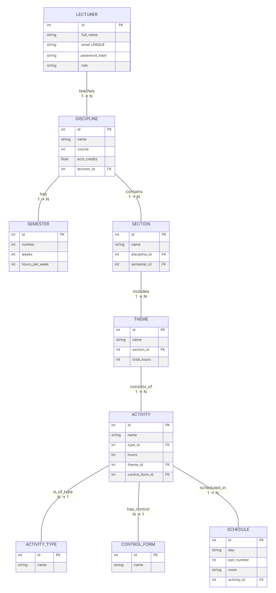

# Curriculum Parser Project
Automated ETL system for parsing teacher curriculum Excel files and validating data.

---

## Project Overview

This project includes:

1. **PostgreSQL Database** – physical data schema storing all curriculum-related information.

## Database Schema

This section describes the **physical database schema** for the diploma project, including ER-diagram, entities, attributes, relations, data types, and constraints.

## ER Diagram

---

## Entities

* LECTURER
* DISCIPLINE
* SEMESTER
* SECTION
* THEME
* ACTIVITY
* ACTIVITY_TYPE
* CONTROL_FORM
* SCHEDULE

---

## Attributes

**LECTURER**: `id`, `full_name`, `email`, `password_hash`, `role` 
**DISCIPLINE**: `id`, `name`, `course`, `ects_credits`, `lecturer_id` 
**SEMESTER**: `id`, `number`, `weeks`, `hours_per_week` 
**SECTION**: `id`, `name`, `discipline_id`, `semester_id` 
**THEME**: `id`, `name`, `section_id`, `total_hours` 
**ACTIVITY**: `id`, `name`, `type_id`, `hours`, `theme_id`, `control_form_id` 
**ACTIVITY_TYPE**: `id`, `name` 
**CONTROL_FORM**: `id`, `name` 
**SCHEDULE**: `id`, `day`, `pair_number`, `room`, `activity_id`

---

## Relations

| Entity 1   | Relationship | Entity 2      | Type  |
| ---------- | ------------ | ------------- | ----- |
| LECTURER   | teaches      | DISCIPLINE    | 1 → N |
| DISCIPLINE | has          | SEMESTER      | 1 → N |
| DISCIPLINE | contains     | SECTION       | 1 → N |
| SECTION    | includes     | THEME         | 1 → N |
| THEME      | consists_of  | ACTIVITY      | 1 → N |
| ACTIVITY   | is_of_type   | ACTIVITY_TYPE | N → 1 |
| ACTIVITY   | has_control  | CONTROL_FORM  | N → 1 |
| ACTIVITY   | scheduled_in | SCHEDULE      | 1 → N |

---

## Data Types

| Attribute       | Type         |
| --------------- | ------------ |
| id              | INT          |
| full_name       | VARCHAR      |
| email           | VARCHAR      |
| password_hash   | VARCHAR      |
| role            | VARCHAR      |
| name            | VARCHAR      |
| course          | INT          |
| ects_credits    | NUMERIC      |
| lecturer_id     | INT          |
| number          | INT          |
| weeks           | INT          |
| hours_per_week  | INT          |
| discipline_id   | INT          |
| semester_id     | INT          |
| section_id      | INT          |
| total_hours     | INT          |
| type_id         | INT          |
| hours           | INT          |
| theme_id        | INT          |
| control_form_id | INT          |
| day             | weekday ENUM |
| pair_number     | INT          |
| room            | VARCHAR      |
| activity_id     | INT          |

---

## Constraints

* Primary Keys: `id` fields in all tables
* Unique: `LECTURER.email`, `ACTIVITY_TYPE.name`, `CONTROL_FORM.name`
* Foreign Keys:

  * `DISCIPLINE.lecturer_id → LECTURER.id`
  * `SECTION.discipline_id → DISCIPLINE.id`
  * `SECTION.semester_id → SEMESTER.id`
  * `THEME.section_id → SECTION.id`
  * `ACTIVITY.type_id → ACTIVITY_TYPE.id`
  * `ACTIVITY.theme_id → THEME.id`
  * `ACTIVITY.control_form_id → CONTROL_FORM.id`
  * `SCHEDULE.activity_id → ACTIVITY.id`
* Checks:

  * `LECTURER.role` IN ('admin','lecturer','viewer')
  * Numeric fields ≥ 0 where applicable

* [Database Schema SQL](db/schema.sql)

---

**Notes:**

* This documentation serves as a centralized reference for project development.

---