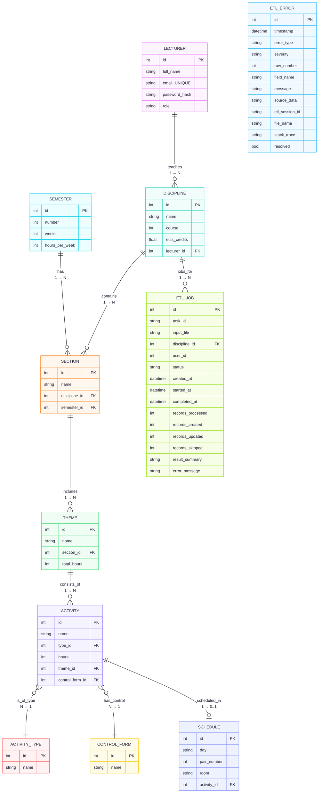

# 🎓 Curriculum Parser Project
Automated ETL system for parsing teacher curriculum Excel files with database integration and change tracking 💻.

---

## 🚀 Project Overview

This project includes:

1. [**PostgreSQL Database**](./db/schema.sql) – physical data schema storing all curriculum-related information.
2. [**ETL Pipeline**](./etl_service/README.md) – automated import and validation of teacher curriculum Excel files with:
   - Data extraction from Excel  
   - Comprehensive validation with error logging
   - Data transformation and aggregation  
   - Database loading with UPSERT logic
   - Materialized Views for summary reports
3. [**CDC (Change Data Capture)**](./db/cdc_triggers.sql) – real-time tracking of database changes via PostgreSQL Triggers
4. [**ORM Layer (SQLAlchemy 2.0)**](./app/README.md) – modern, type-safe connection between Python and PostgreSQL

## 🗂️ Database Schema

This section describes the **physical database schema** for the diploma project, including ER-diagram, entities, attributes, relations, data types, and constraints.

## ER Diagram

```mermaid
---
config:
  layout: dagre
  theme: redux-color
---
erDiagram
    LECTURER ||--o{ DISCIPLINE : "teaches<br>1 → N"
    DISCIPLINE ||--o{ SECTION : "contains<br>1 → N"
    SEMESTER ||--o{ SECTION : "has<br>1 → N"
    SECTION ||--o{ THEME : "includes<br>1 → N"
    THEME ||--o{ ACTIVITY : "consists_of<br>1 → N"
    ACTIVITY }o--|| ACTIVITY_TYPE : "is_of_type<br>N → 1"
    ACTIVITY }o--|| CONTROL_FORM : "has_control<br>N → 1"
    ACTIVITY ||--o| SCHEDULE : "scheduled_in<br>1 → 0..1"
    DISCIPLINE ||--o{ ETL_JOB : "jobs_for<br>1 → N"
    LECTURER {
        int id PK
        string full_name
        string email_UNIQUE
        string password_hash
        string role
    }
    DISCIPLINE {
        int id PK
        string name
        int course
        float ects_credits
        int lecturer_id FK
    }
    SEMESTER {
        int id PK
        int number
        int weeks
        int hours_per_week
    }
    SECTION {
        int id PK
        string name
        int discipline_id FK
        int semester_id FK
    }
    THEME {
        int id PK
        string name
        int section_id FK
        int total_hours
    }
    ACTIVITY {
        int id PK
        string name
        int type_id FK
        int hours
        int theme_id FK
        int control_form_id FK
    }
    ACTIVITY_TYPE {
        int id PK
        string name
    }
    CONTROL_FORM {
        int id PK
        string name
    }
    SCHEDULE {
        int id PK
        string day
        int pair_number
        string room
        int activity_id FK
    }
    ETL_JOB {
        int id PK
        string task_id
        string input_file
        int discipline_id FK
        int user_id
        string status
        datetime created_at
        datetime started_at
        datetime completed_at
        int records_processed
        int records_created
        int records_updated
        int records_skipped
        string result_summary
        string error_message
    }
    ETL_ERROR {
        int id PK
        datetime timestamp
        string error_type
        string severity
        int row_number
        string field_name
        string message
        string source_data
        string etl_session_id
        string file_name
        string stack_trace
        bool resolved
    }

```

---

## 📌 Entities

* LECTURER
* STUDENT
* DISCIPLINE
* SEMESTER
* SECTION
* THEME
* ACTIVITY
* ACTIVITY_TYPE
* CONTROL_FORM
* SCHEDULE
* ETL_JOB
* ETL_ERROR

---

## 📝 Attributes

**LECTURER**: `id`, `full_name`, `email`, `password_hash`, `role` 
**STUDENT**: `id`, `full_name`, `email`, `password_hash`, `role` 
**DISCIPLINE**: `id`, `name`, `course`, `ects_credits`, `lecturer_id` 
**SEMESTER**: `id`, `number`, `weeks`, `hours_per_week` 
**SECTION**: `id`, `name`, `discipline_id`, `semester_id` 
**THEME**: `id`, `name`, `section_id`, `total_hours` 
**ACTIVITY**: `id`, `name`, `type_id`, `hours`, `theme_id`, `control_form_id` 
**ACTIVITY_TYPE**: `id`, `name` 
**CONTROL_FORM**: `id`, `name` 
**SCHEDULE**: `id`, `day`, `pair_number`, `room`, `activity_id` 
**ETL_JOB**: `id`, `task_id`, `input_file`, `discipline_id`, `user_id`, `status`, `created_at`, `started_at`, `completed_at`, `records_processed`, `records_created`, `records_updated`, `records_skipped`, `result_summary`, `error_message` 
**ETL_ERROR**: `id`, `timestamp`, `error_type`, `severity`, `row_number`, `field_name`, `message`, `source_data`, `etl_session_id`, `file_name`, `stack_trace`, `resolved`

---

## 🔗 Relations

| Entity 1   | Relationship | Entity 2      | Type  |
| ---------- | ------------ | ------------- | ----- |
| LECTURER   | teaches      | DISCIPLINE    | 1 → N |
| DISCIPLINE | contains     | SECTION       | 1 → N |
| SEMESTER   | has          | SECTION       | 1 → N |
| SECTION    | includes     | THEME         | 1 → N |
| THEME      | consists_of  | ACTIVITY      | 1 → N |
| ACTIVITY   | is_of_type   | ACTIVITY_TYPE | N → 1 |
| ACTIVITY   | has_control  | CONTROL_FORM  | N → 1 |
| ACTIVITY   | scheduled_in | SCHEDULE      | 1 → 0..1 |
| DISCIPLINE | jobs_for     | ETL_JOB       | 1 → N |

---

## 🔢 Data Types

| Attribute       | Type         |
| --------------- | ------------ |
| id              | INT          |
| full_name       | VARCHAR      |
| email           | VARCHAR      |
| password_hash   | VARCHAR      |
| role            | VARCHAR      |
| name            | VARCHAR      |
| course          | INT          |
| ects_credits    | NUMERIC      |
| lecturer_id     | INT          |
| number          | INT          |
| weeks           | INT          |
| hours_per_week  | INT          |
| discipline_id   | INT          |
| semester_id     | INT          |
| section_id      | INT          |
| total_hours     | INT          |
| type_id         | INT          |
| hours           | INT          |
| theme_id        | INT          |
| control_form_id | INT          |
| day             | weekday ENUM |
| pair_number     | INT          |
| room            | VARCHAR      |
| activity_id     | INT          |
| task_id         | VARCHAR      |
| input_file      | VARCHAR      |
| user_id         | INT          |
| status          | ENUM         |
| created_at      | DATETIME     |
| started_at      | DATETIME     |
| completed_at    | DATETIME     |
| records_processed | INT        |
| records_created | INT          |
| records_updated | INT          |
| records_skipped | INT          |
| result_summary  | TEXT         |
| error_message   | TEXT         |
| timestamp       | DATETIME     |
| error_type      | ENUM         |
| severity        | ENUM         |
| row_number      | INT          |
| field_name      | VARCHAR      |
| source_data     | TEXT         |
| etl_session_id  | UUID         |
| file_name       | VARCHAR      |
| stack_trace     | TEXT         |
| resolved        | BOOLEAN      |

---

## ✅ Constraints

* Primary Keys: `id` fields in all tables
* Unique: `LECTURER.email`, `STUDENT.email`, `ACTIVITY_TYPE.name`, `CONTROL_FORM.name`, `ETL_JOB.task_id`
* Foreign Keys:

  * `DISCIPLINE.lecturer_id → LECTURER.id`
  * `SECTION.discipline_id → DISCIPLINE.id`
  * `SECTION.semester_id → SEMESTER.id`
  * `THEME.section_id → SECTION.id`
  * `ACTIVITY.type_id → ACTIVITY_TYPE.id`
  * `ACTIVITY.theme_id → THEME.id`
  * `ACTIVITY.control_form_id → CONTROL_FORM.id`
  * `SCHEDULE.activity_id → ACTIVITY.id`
    * `ETL_JOB.discipline_id → DISCIPLINE.id`
* Checks:

    * `LECTURER.role` IN ('admin','lecturer','viewer')
    * `STUDENT.role` IN ('admin','lecturer','viewer')
  * Numeric fields ≥ 0 where applicable

* [Database Schema SQL](db/schema.sql)

---

⚠️ **Notes:**

* This documentation serves as a centralized reference for project development.

---